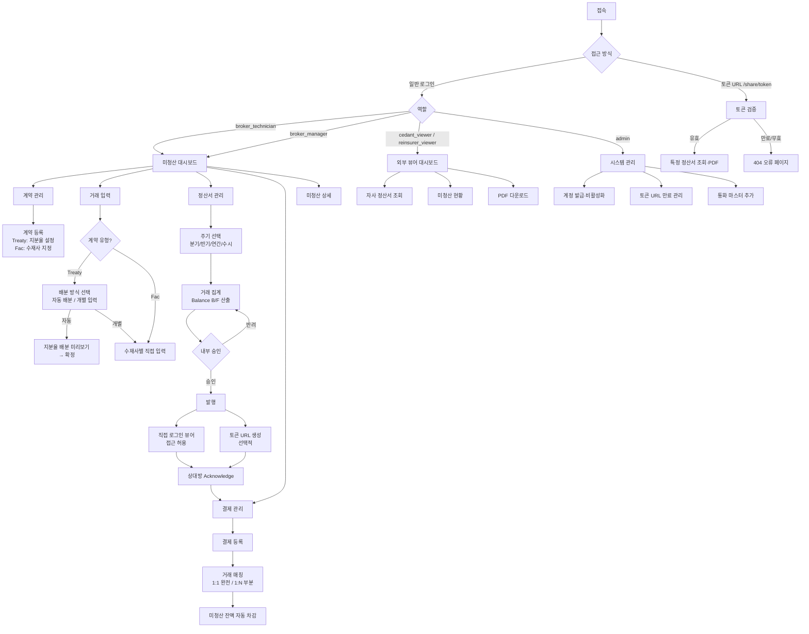

# 재보험 정청산 관리 시스템 (Reinsurance Final Settlement Management System)
## 웹 개발 설계서 v1.3

> **작성 기준일**: 2026-04-02
> **기술 스택**: Next.js 15 (App Router) · TweakCN · Supabase
> **대상**: 보험중개사 내부 직원 및 외부 조회 뷰어(출재사·수재사)

### 버전 이력

| 버전 | 날짜 | 주요 변경 |
|------|------|---------|
| v1.0 | 2026-04-02 | 최초 작성 |
| v1.1 | 2026-04-02 | Treaty 자동배분 구체화, 분기+수시 주기, 직접 로그인 방식, 5개 통화 확정 |
| v1.2 | 2026-04-02 | 정산 주기 4종(분기·반기·연간·수시) 전체 지원, 외부 뷰어 이중 접근(직접 로그인+토큰 URL), 통화 확장 가능 구조(기본 5종 + Custom) |
| v1.3 | 2026-04-02 | 심층 인터뷰 기반 업데이트: XL 수동 전용, B/F 이월 공식, AC 발행 단위, Disputed 워크플로우, 스냅샷 저장, Parent TX 처리, 환율 블로킹, 테마 토글, 싱글 테넌트, Edge Function 미사용 등 27개 결정사항 반영 |

---

## 목차

1. [프로젝트 컨텍스트](#1-프로젝트-컨텍스트)
2. [도메인 개념 및 업무 흐름](#2-도메인-개념-및-업무-흐름)
3. [페이지 목록 및 사용자 흐름](#3-페이지-목록-및-사용자-흐름)
4. [데이터 모델 (Supabase)](#4-데이터-모델-supabase)
5. [UI/UX 방향](#5-uiux-방향)
6. [구현 스펙](#6-구현-스펙)
7. [검증 및 실패 처리 전략](#7-검증-및-실패-처리-전략)
8. [참고 자료 및 용어 정의](#8-참고-자료-및-용어-정의)

---

## 1. 프로젝트 컨텍스트

### 1.1 목적

보험중개사(Broker)가 해외 수재사(Reinsurer)와 국내 출재사(Cedant) 사이에서 수행하는
**정청산(Final Settlement)** 업무를 디지털화하여:

- 보험료(Premium) 및 보험금(Loss/Claim)의 정확한 흐름 추적
- 미청산 잔액(Outstanding Balance)의 실시간 현황 파악
- **분기·반기·연간·수시** 정산서(Account Current) 생성 및 승인 워크플로우 자동화
- 다통화(기본 5종 + 확장 가능) 수동 환율 적용 이력 관리
- 감사 추적(Audit Trail) 및 정산서 잠금 무결성 확보

### 1.2 대상 사용자

| 역할 | 설명 | 접근 수준 |
|------|------|---------|
| **브로커 실무자** (Broker Technician) | 거래 입력, 정산서 작성, 대사 수행 | 전체 쓰기 (승인 제외) |
| **브로커 관리자** (Broker Manager) | 정산서 최종 승인, 미청산 현황 경영 보고 | 승인 권한 + 전체 조회 |
| **출재사 뷰어** (Cedant Viewer) | 자사 관련 거래 및 정산 현황 조회 + **AC Acknowledge** | 자사 데이터 읽기 + Acknowledge 버튼 클릭 |
| **수재사 뷰어** (Reinsurer Viewer) | 자사 수재 거래 및 정산 현황 조회 + **AC Acknowledge** | 자사 데이터 읽기 + Acknowledge 버튼 클릭 |
| **시스템 관리자** (System Admin) | 사용자·마스터 데이터·토큰 링크 관리 | 전체 관리 권한 |

> **계정 생성 방식 (v1.3)**: Admin이 Supabase `createUser` API로 계정 생성 + 비밀번호 직접 설정. 이메일 초대(inviteUserByEmail)는 v2 예정. 외부 뷰어(cedant_viewer / reinsurer_viewer)는 시스템 내 버튼 클릭으로 AC Acknowledge 상태 전환 가능.

### 1.3 핵심 기능 요약

1. **계약 마스터 관리** — Treaty(자동 배분) / Facultative(개별 입력) 계약 등록
2. **거래 입력** — 보험료, 보험금, 수수료, 환급금 등 항목별 입력
3. **Account Current 생성** — 4가지 주기(분기·반기·연간·수시) 정산서 자동 집계
4. **대사(Reconciliation)** — 브로커 장부 ↔ 출재사/수재사 장부 대사
5. **미청산 현황 대시보드** — 상대방별·계약별·통화별 Outstanding + Aging 분석
6. **결제(Settlement) 등록** — 실제 송금/수금 내역 매칭 (1:1 완전 / 1:N 부분)
7. **환율 관리** — 다통화 수동 환율 이력 (기본 5종 + 관리자 확장)
8. **외부 공유** — 직접 로그인 포털 + 만료형 토큰 URL 이중 제공
9. **보고서 출력** — PDF/Excel 정산서 및 현황 보고서

### 1.4 제약조건

| 제약 | 내용 |
|------|------|
| **보안** | RLS로 회사별 데이터 격리; 토큰 URL은 만료 시간·접근 로그 필수 |
| **감사 추적** | 모든 거래 수정/삭제 이력 보존 (Soft Delete + Audit Log) |
| **정산서 잠금** | 승인 후 해당 거래 수정 차단 (`is_locked = true`) |
| **배분 정합성** | Treaty 자동 배분 시 Σ signed_line = 100% 저장 전 검증 |
| **성능** | 미청산 대시보드 로딩 3초 이내 (인덱스 최적화) |
| **통화 일관성** | 모든 금액은 원화(KRW) 환산값을 병행 저장하여 합산 보고 지원 |

### 1.5 지원 통화 (v1.2)

| 구분 | 통화 | 코드 | 비고 |
|------|------|------|------|
| 기본 지원 | 미국 달러 | USD | 주요 결제 통화 |
| 기본 지원 | 유로 | EUR | 유럽 수재사 |
| 기본 지원 | 영국 파운드 | GBP | 런던 시장 |
| 기본 지원 | 일본 엔 | JPY | 아시아 수재사 |
| 기본 지원 | 한국 원 | KRW | 국내 기준 통화 |
| **확장** | 기타 통화 | Custom | 관리자가 `rs_currencies` 테이블에 추가 |

> **기준 통화**: KRW. 모든 외화 거래는 `amount_krw`에 환산값 병행 저장.  
> 신규 통화 추가 시 `rs_currencies` 마스터 등록 → 환율 입력 → 거래 선택 가능.

---

## 2. 도메인 개념 및 업무 흐름

### 2.1 재보험 정청산 업무 개념도

```
[출재사 (Cedant)]
    │  ① 보험료 납입 지시 / 보험금 청구
    ▼
[보험중개사 (Broker)] ←─── 본 시스템 관리 영역 ───→
    │  ② 거래 기록
    │     ├─ Treaty  : 수재사 지분율 기준 자동 배분 또는 개별 입력
    │     └─ Fac     : 수재사별 금액 직접 입력
    │  ③ Account Current 발행 (분기·반기·연간·수시)
    │  ④ 대사 및 미청산 추적 (통화별 Aging 관리)
    │  ⑤ 결제 지시 및 확인 (완전/부분 매칭)
    │  ⑥ 외부 공유
    │     ├─ 직접 로그인 (계정 발급)
    │     └─ 토큰 URL (만료형 링크)
    ▼
[수재사/출재사]  ⑦ 정산서 확인 및 Acknowledge
    ▼
[최종 정청산 완료]
```

### 2.2 수재사 배분 로직

#### Treaty — Proportional (비례재보험)

```
총 보험료 입력 (출재사 기준 총액)
  → 방식 선택:
    [A] 자동 배분: rs_contract_shares에서 Signed Line 조회
          → transaction_date 기준 유효한 signed_line 룩업
             (effective_from ≤ transaction_date ≤ effective_to 또는 effective_to IS NULL)
          → 수재사별 트랜잭션 자동 생성 (allocation_type = 'auto')
          → amount = 총액 × (signed_line / 100)
          → Σ signed_line = 100% 검증 (불일치 시 저장 차단)
          → 소수점 오차는 1순위 수재사(order_of_priority = 1) 레코드에 흡수
    [B] 개별 입력: 수재사별 금액 직접 입력 (allocation_type = 'manual')
          → 합계 검증 없음 (협의 결과 그대로 입력)
```

> **지분율 유효기간 (Endorsement 지원)**: 계약 중간에 지분율 변경(Endorsement)이 발생할 수 있으므로, 자동 배분 시 `transaction_date`를 기준으로 해당 시점에 유효한 `signed_line`을 조회한다 (`getEffectiveShares` 함수 §6.3 참조).

#### Treaty — Non-Proportional (비비례재보험, XL 등)

```
v1에서는 자동 배분 미지원.
treaty_type = 'non_proportional' 계약의 모든 거래는
  allocation_type = 'manual' (수동 개별 입력만 허용)
자동 배분 버튼 비활성화 + 안내 문구 표시.
(v2에서 XL Layer별 배분 로직 검토 예정)
```

#### Facultative

```
수재사별 협의된 금액을 직접 입력 (자동 배분 없음)
각 수재사 거래를 독립 레코드로 관리
```

### 2.3 Account Current 정산 주기 (v1.2 확장)

| 주기 | 코드 | 기간 기본값 | 설명 |
|------|------|-----------|------|
| **분기** | `quarterly` | 1–3월, 4–6월, 7–9월, 10–12월 | 가장 일반적, 분기 말 자동 제안 |
| **반기** | `semiannual` | 1–6월, 7–12월 | 중간 규모 계약 |
| **연간** | `annual` | 1–12월 | 대형 Treaty 일부 |
| **수시** | `adhoc` | 사용자 지정 | 계약 종료·분쟁 해결 등 |

> 정산서 생성 시 주기 선택 → 해당 기간에 맞는 `confirmed/billed` 거래 자동 집계.  
> 동일 계약·동일 기간 중복 발행은 시스템에서 경고 표시 (차단하지 않음, 수시 주기 허용).

### 2.4 외부 뷰어 접근 방식 (v1.2 이중 지원)

#### 방식 A: 직접 로그인 계정 (Portal)

```
시스템 관리자 → 외부 뷰어 계정 생성 (Supabase Auth)
  → 역할 설정 (cedant_viewer | reinsurer_viewer) + company_id 연결
  → 이메일로 초대 링크 발송
  → 뷰어: /external/dashboard 접근 (세션 기반, 상시 유효)
  → RLS: company_id 기준 자사 데이터만 노출
```

#### 방식 B: 만료형 토큰 URL (Shared Link)

```
브로커 실무자 → 특정 정산서 선택 → "공유 링크 생성"
  → rs_share_tokens 레코드 생성 (token, expires_at, target_id, target_type)
  → /share/{token} URL 생성 및 복사
  → 수신자: 로그인 없이 해당 정산서만 조회·다운로드
  → 만료: 기본 30일 (설정 변경 가능), 만료 후 404 반환
  → 접근 로그: rs_share_token_logs에 IP·시각 기록
```

| 비교 항목 | 직접 로그인 | 토큰 URL |
|---------|-----------|---------|
| 로그인 필요 | ✅ | ❌ |
| 접근 범위 | 자사 전체 데이터 | 지정 정산서 1건 |
| 유효 기간 | 상시 (계정 비활성화 시 차단) | 30일 (설정 변경 가능) |
| 감사 추적 | Supabase Auth 로그 | rs_share_token_logs |
| 주 사용 사례 | 상시 거래 파트너 | 1회성 정산서 공유 |

### 2.5 정청산 핵심 업무 흐름

#### 흐름 1: 보험료 정산

```
계약 등록 (Treaty: 지분율 설정 / Fac: 수재사 지정)
  → 보험료 거래 입력
      ├─ Treaty Proportional 자동 배분: 미리보기 확인 → 확정
      ├─ Treaty Non-Proportional: 수동 개별 입력만 허용
      └─ Fac 개별 입력: 수재사별 직접 입력
    → Account Current 생성 (주기 선택 → 거래 집계 → B/F 산출)
      → 내부 승인 (Broker Manager)
        → 외부 발행 (issued: 직접 로그인 뷰어 접근 허용 + 선택적 토큰 URL 생성)
          → 상대방 Acknowledge (외부 뷰어 버튼 클릭)
            → 결제 등록 → 매칭 → 미청산 차감 → 청산 완료
```

#### 흐름 4: Disputed 해결 (재발행)

```
상대방이 AC 내용 이의 제기 → AC 상태 'disputed'로 전환
  → 브로커가 AC를 'cancelled' 처리
      → 연결 거래의 is_locked 자동 false로 해제 (DB 트리거)
      → 원본 AC 기록은 보존 (Soft Cancel)
  → 새 AC draft 생성 (재발행)
      → 거래 수정 또는 추가 후 재집계
      → 내부 승인 → 재발행 → 상대방 재확인
```

#### 흐름 2: 보험금 정산

```
사고 발생 통보 수신
  → 보험금 청구 입력 (loss_reference 기재)
    → 수재사 배분 (Treaty 자동 / Fac 개별)
      → Account Current 반영
        → 결제 등록 → 청산 완료
```

#### 흐름 3: 미청산 관리

```
정기(분기 말) 또는 수시 → 미청산 잔액 산출 (통화별)
  → Aging 분석 (Current / 30 / 60 / 90 / 90+ 일)
  → Outstanding 리포트 생성
    → 상대방별 Follow-up
      → 결제 수령 → 매칭 → 잔액 차감
        → 잔액 = 0 → Closed
```

### 2.6 Account Current 항목 구조

| 항목 구분 | 세부 항목 | 브로커 기준 | transaction_type |
|---------|---------|-----------|----------------|
| 보험료 수입 | Written Premium | 수취 (+) | `premium` |
| 환급 보험료 | Return Premium | 지급 (−) | `return_premium` |
| 보험금 지급 | Loss Payment | 지급 (−) | `loss` |
| 중개 수수료 | Brokerage Commission | 수취 (+) | `commission` |
| 보증금 보험료 | Deposit Premium | subtotal_other에 포함 | `deposit_premium` |
| 이자 | Interest on Funds | subtotal_other에 포함 | `interest` |
| 전기 이월 | Balance B/F | 직전 AC 순 미청산 잔액 이월 | — |
| **금기 순액** | **Net Balance** | **당기 합산 결과** | — |

> **B/F 계산 공식 (v1.3)**: `B/F = 직전 AC net_balance − 직전 AC에 매칭된 settlement 합계 (rs_settlement_matches)`
>
> 즉, 이전 AC의 **순 미청산 잔액만** 이월한다. 직전 AC가 없으면 B/F = 0.
> 부분 결제가 있는 경우 미결제 잔액이 그대로 다음 AC의 B/F로 자동 반영된다.
>
> **Deposit Premium**: 별도 조정 로직 없이 `transaction_type='deposit_premium'`으로 일반 항목 처리. `subtotal_other`에 포함.

### 2.7 AC 발행 단위 및 Direction 결정 (v1.3 신규)

#### AC 발행 단위

- **수재사별 별도 AC 발행**: 1개의 AC는 1개의 수재사(`counterparty_id`)에 대해 발행.
- 동일 계약이라도 수재사가 다르면 AC를 따로 발행한다.
- `rs_account_currents.counterparty_id` = 해당 수재사 ID.

#### Direction 자동 결정

```
1. 해당 counterparty의 해당 기간 모든 항목 집계
2. net_balance 부호로 direction 자동 결정:
     net_balance > 0 → direction = 'to_reinsurer'  (수재사가 브로커에게 지급)
     net_balance < 0 → direction = 'to_cedant'     (브로커가 수재사에게 지급)
     net_balance = 0 → direction = 'to_reinsurer'  (기본값, 무청구 AC)
3. 별도 수동 지정 불필요 — AC 저장 시 자동 계산 후 기록
```

#### 이종 통화 처리

- 동일 counterparty라도 거래 통화가 다른 경우, 계약의 `settlement_currency`로 환산하여 **단일 통화 AC**로 발행.
- 환산 환율은 AC 생성 시점의 `rs_exchange_rates` 등록값 사용.

#### 대사(Reconciliation) 데이터 입력

- 실무자가 상대방 Statement를 보고 **수동 직접 입력** (자동 연동 없음).
- 입력 단위: 거래(transaction) 1건 단위 — 브로커 금액 vs 상대방 주장 금액 비교.

---

## 3. 페이지 목록 및 사용자 흐름

### 3.1 페이지 목록

| 경로 | 페이지명 | 설명 | 인증 | 접근 역할 |
|------|--------|------|------|---------|
| `/` | 랜딩/로그인 | 로그인 및 시스템 소개 | 불필요 | 전체 |
| `/dashboard` | 미청산 대시보드 | Outstanding KPI, Aging 분석 | 필요 | 브로커 |
| `/contracts` | 계약 목록 | Treaty/Fac 계약 목록 + 상태 | 필요 | 브로커 |
| `/contracts/new` | 계약 등록 | 신규 계약 입력, 수재사 지분 설정 | 필요 | 브로커 실무자↑ |
| `/contracts/[id]` | 계약 상세 | 계약 정보·지분·연결 거래 목록 | 필요 | 브로커 |
| `/transactions` | 거래 목록 | 전체 거래 내역, 필터·검색 | 필요 | 브로커 |
| `/transactions/new` | 거래 입력 | 보험료/보험금 입력, 배분 미리보기 | 필요 | 브로커 실무자↑ |
| `/transactions/[id]` | 거래 상세 | 거래 상세 + Audit Trail | 필요 | 브로커 |
| `/account-currents` | 정산서 목록 | AC 발행 목록 (주기별 필터) | 필요 | 브로커 |
| `/account-currents/new` | 정산서 생성 | 주기 선택 → 거래 집계 → B/F 산출 | 필요 | 브로커 실무자↑ |
| `/account-currents/[id]` | 정산서 상세 | 항목 검토·승인·발행·토큰 URL 생성 | 필요 | 브로커 |
| `/reconciliation` | 대사 관리 | 브로커 ↔ 거래상대방 대사 그리드 | 필요 | 브로커 실무자↑ |
| `/settlements` | 결제 관리 | 송금/수금 등록 + 매칭 패널 | 필요 | 브로커 실무자↑ |
| `/outstanding` | 미청산 상세 | 상대방·계약·통화·Aging 세부 현황 | 필요 | 브로커 |
| `/exchange-rates` | 환율 관리 | 다통화 환율 이력 입력/조회 | 필요 | 브로커 실무자↑ |
| `/counterparties` | 거래상대방 관리 | 출재사/수재사 마스터 CRUD | 필요 | 브로커 관리자↑ |
| `/reports` | 보고서 | PDF/Excel 출력 | 필요 | 브로커 |
| `/admin` | 시스템 관리 | 사용자·계정·토큰 URL 관리 | 필요 | 시스템 관리자 |
| `/external/dashboard` | 외부 대시보드 | 자사 정산 현황 조회 (읽기 전용) | 필요 (계정) | 뷰어 |
| `/external/account-currents/[id]` | 외부 정산서 조회 | 발행된 AC 조회·PDF 다운로드 | 필요 (계정) | 뷰어 |
| `/share/[token]` | 토큰 공유 정산서 | 로그인 없이 특정 AC 조회·다운로드 | 불필요 (토큰) | 토큰 보유자 |

### 3.2 사용자 흐름 다이어그램



### 3.3 인증 및 권한 분기

```
접속 방식 ①: 일반 로그인 (Supabase Auth)
  ├─ broker_technician → /dashboard
  │     쓰기: 거래·계약·정산서·결제·환율·대사
  │     승인: ❌  |  토큰 URL 생성: ✅
  ├─ broker_manager   → /dashboard
  │     쓰기: 전체  |  승인: ✅  |  토큰 URL 생성: ✅
  ├─ cedant_viewer    → /external/dashboard
  │     읽기: 자사 company_id가 cedant_id인 계약·거래·정산서만
  ├─ reinsurer_viewer → /external/dashboard
  │     읽기: 자사 company_id가 rs_contract_shares.reinsurer_id인 계약만
  └─ admin            → /admin

접속 방식 ②: 토큰 URL /share/{token}
  → rs_share_tokens 조회
    ├─ 유효 (expires_at > NOW, revoked = false) → 해당 AC만 조회·다운로드
    │     접근 로그 rs_share_token_logs 기록
    └─ 만료/취소 → 404 반환
```

---

## 4. 데이터 모델 (Supabase)

> 모든 테이블은 `rs_` 접두어 사용 (Reinsurance Settlement)

### 4.1 테이블 목록

| 테이블명 | 설명 | RLS | Realtime |
|---------|------|-----|---------|
| `rs_currencies` | 통화 마스터 (확장 가능) | ✅ | ❌ |
| `rs_counterparties` | 출재사/수재사 마스터 | ✅ | ❌ |
| `rs_contracts` | Treaty/Fac 계약 마스터 | ✅ | ❌ |
| `rs_contract_shares` | 계약별 수재사 지분율 (Treaty) | ✅ | ❌ |
| `rs_transactions` | 개별 거래 내역 | ✅ | ❌ |
| `rs_transaction_audit` | 거래 수정 이력 (Audit Trail) | ✅ | ❌ |
| `rs_account_currents` | 정산서 헤더 | ✅ | ✅ |
| `rs_account_current_items` | 정산서 상세 항목 | ✅ | ❌ |
| `rs_settlements` | 실제 결제(송금/수금) 내역 | ✅ | ✅ |
| `rs_settlement_matches` | 결제 ↔ 정산서 매칭 | ✅ | ❌ |
| `rs_exchange_rates` | 통화별 환율 이력 | ✅ | ❌ |
| `rs_reconciliation_items` | 대사 차이 항목 | ✅ | ❌ |
| `rs_share_tokens` | 만료형 토큰 URL 관리 | ✅ | ❌ |
| `rs_share_token_logs` | 토큰 URL 접근 로그 | ✅ | ❌ |
| `rs_user_profiles` | 사용자 프로필·역할·소속 | ✅ | ❌ |

### 4.2 핵심 테이블 스키마 개요

#### `rs_currencies` — 통화 마스터 (v1.2 신규)

```sql
code          char(3) PK             -- ISO 통화 코드 (USD, EUR, GBP, JPY, KRW ...)
name_ko       text                   -- 한국어 명칭
name_en       text                   -- 영문 명칭
symbol        text                   -- 기호 ($, €, £, ¥, ₩)
decimal_digits int DEFAULT 2         -- 소수점 자리수 (JPY: 0, KRW: 0, 기타: 2)
is_base       boolean DEFAULT false  -- 기준 통화 (KRW = true)
is_active     boolean DEFAULT true
display_order int                    -- UI 정렬 순서
created_by    uuid FK → auth.users
created_at    timestamptz
-- 초기 데이터: USD, EUR, GBP, JPY, KRW
```

#### `rs_counterparties` — 거래상대방

```sql
id                uuid PK
company_code      text UNIQUE
company_name_ko   text
company_name_en   text
company_type      text     -- 'cedant' | 'reinsurer' | 'both'
country_code      char(2)  -- ISO 국가코드
default_currency  char(3) FK → rs_currencies
contact_email     text
is_active         boolean DEFAULT true
created_at        timestamptz
updated_at        timestamptz
```

#### `rs_contracts` — 계약 마스터

```sql
id                uuid PK
contract_no       text UNIQUE         -- 사내 채번 (예: TRT-2025-001)
contract_type     text                -- 'treaty' | 'facultative'
treaty_type       text                -- 'proportional' | 'non_proportional'
class_of_business text                -- 'fire'|'marine'|'liability'|'engineering'|'misc'
cedant_id         uuid FK → rs_counterparties
inception_date    date
expiry_date       date
settlement_currency char(3) FK → rs_currencies
settlement_period text                -- 'quarterly'|'semiannual'|'annual'|'adhoc'
status            text                -- 'active'|'expired'|'cancelled'
description       text
created_by        uuid FK → auth.users
created_at        timestamptz
updated_at        timestamptz
```

#### `rs_contract_shares` — 수재사 지분율

```sql
id                uuid PK
contract_id       uuid FK → rs_contracts
reinsurer_id      uuid FK → rs_counterparties
signed_line       numeric(6,3)        -- 지분율 % (예: 30.000)
order_of_priority int
effective_from    date
effective_to      date                -- NULL = 현재 유효
-- CONSTRAINT: 동일 contract_id + 유효기간 기준 signed_line 합계 = 100
```

#### `rs_transactions` — 거래 내역

```sql
id                uuid PK
transaction_no    text UNIQUE         -- 자동 채번 (예: TXN-2025-00001)
contract_id       uuid FK → rs_contracts
contract_type     text                -- 비정규화 ('treaty'|'facultative')
transaction_type  text                -- 'premium'|'return_premium'|'loss'|
                                      --  'commission'|'deposit_premium'|'interest'|'adjustment'
direction         text                -- 'receivable'|'payable' (브로커 기준)
counterparty_id   uuid FK → rs_counterparties
parent_tx_id      uuid FK → rs_transactions  -- Treaty 자동배분 시 원거래 참조
allocation_type   text                -- 'auto'|'manual'|null (Treaty 배분 방식 기록)

-- 금액
amount_original   numeric(18,2)
currency_code     char(3) FK → rs_currencies
exchange_rate     numeric(15,6)       -- → KRW 환율
amount_krw        numeric(18,2)       -- KRW 환산 (병행 저장)

-- 날짜
transaction_date  date
due_date          date
period_from       date
period_to         date

-- 참조
loss_reference    text
description       text

-- 상태
status            text                -- 'draft'|'confirmed'|'billed'|'settled'|'cancelled'
account_current_id uuid FK → rs_account_currents
is_locked         boolean DEFAULT false
is_deleted        boolean DEFAULT false

-- Treaty 자동 배분 Parent 식별 (v1.3)
-- is_allocation_parent = true: 출재사(Cedant)용 원거래, Outstanding 계산에서 제외
-- Outstanding 계산 시 parent_tx_id IS NOT NULL (자식 레코드)만 사용
is_allocation_parent boolean DEFAULT false

created_by        uuid FK → auth.users
updated_by        uuid FK → auth.users
created_at        timestamptz
updated_at        timestamptz
```

#### `rs_account_currents` — 정산서

```sql
id                uuid PK
ac_no             text UNIQUE         -- 채번 (예: AC-2025-Q1-001)
contract_id       uuid FK → rs_contracts
counterparty_id   uuid FK → rs_counterparties
direction         text                -- 'to_cedant'|'to_reinsurer'
period_type       text                -- 'quarterly'|'semiannual'|'annual'|'adhoc'
period_from       date
period_to         date
currency_code     char(3) FK → rs_currencies

-- 집계 금액
balance_bf        numeric(18,2)       -- Balance Brought Forward
subtotal_premium  numeric(18,2)
subtotal_loss     numeric(18,2)
subtotal_commission numeric(18,2)
subtotal_other    numeric(18,2)
net_balance       numeric(18,2)       -- 순액

-- 승인 워크플로우
status            text                -- 'draft'|'pending_approval'|'approved'|
                                      --  'issued'|'acknowledged'|'disputed'|'cancelled'
-- cancelled: Disputed 해결 시 원본 AC를 cancelled 처리 → 연결 거래 잠금 자동 해제
approved_by       uuid FK → auth.users
approved_at       timestamptz
issued_at         timestamptz
due_date          date
notes             text

created_by        uuid FK → auth.users
created_at        timestamptz
updated_at        timestamptz
```

#### `rs_account_current_items` — 정산서 스냅샷 항목 (v1.3 스키마 확정)

```sql
-- AC가 'issued' 상태로 전환될 때, 해당 시점의 거래 항목을 스냅샷으로 저장.
-- 이후 원본 거래가 수정되어도 AC 발행 시점의 내역이 보존됨.
ac_id                   uuid FK → rs_account_currents
tx_id                   uuid FK → rs_transactions
transaction_type        text         -- 'premium'|'return_premium'|'loss'|'commission'|'deposit_premium'|'interest'|'adjustment'
description             text
amount_original         numeric(18,2)
currency_code           char(3) FK → rs_currencies
exchange_rate           numeric(15,6)
amount_settlement_currency numeric(18,2)  -- AC의 settlement_currency로 환산된 금액
direction               text         -- 'receivable'|'payable'
snapshot_date           timestamptz  -- 스냅샷 생성 시각 (= issued_at)
-- PK: (ac_id, tx_id)
```

#### `rs_settlements` — 결제 내역

```sql
id                uuid PK
settlement_no     text UNIQUE         -- 채번 (예: PAY-2025-00001)
settlement_type   text                -- 'receipt'|'payment' (브로커 기준)
counterparty_id   uuid FK → rs_counterparties
amount            numeric(18,2)
currency_code     char(3) FK → rs_currencies
exchange_rate     numeric(15,6)
amount_krw        numeric(18,2)
settlement_date   date                -- 실제 Value Date
bank_reference    text
match_status      text                -- 'unmatched'|'partial'|'fully_matched'
matched_amount    numeric(18,2) DEFAULT 0
notes             text
created_by        uuid FK → auth.users
created_at        timestamptz
```

#### `rs_share_tokens` — 토큰 URL 관리 (v1.2 신규)

```sql
id                uuid PK
token             text UNIQUE         -- 무작위 생성 (crypto.randomUUID())
target_type       text                -- 'account_current' (향후 확장 가능)
target_id         uuid                -- rs_account_currents.id
created_by        uuid FK → auth.users
expires_at        timestamptz         -- 기본: 생성 시각 + 30일
revoked           boolean DEFAULT false
revoked_by        uuid FK → auth.users
revoked_at        timestamptz
notes             text                -- 공유 목적 메모
created_at        timestamptz
```

#### `rs_share_token_logs` — 토큰 접근 로그 (v1.2 신규)

```sql
id                uuid PK
token_id          uuid FK → rs_share_tokens
accessed_at       timestamptz
ip_address        inet
user_agent        text
action            text                -- 'view'|'download_pdf'
```

#### `rs_user_profiles` — 사용자 프로필 (v1.3 스키마 확정)

```sql
id            uuid PK DEFAULT gen_random_uuid()
user_id       uuid UNIQUE FK → auth.users  -- Supabase Auth 사용자와 1:1 연결
role          text        -- 'broker_technician'|'broker_manager'|'cedant_viewer'|
                          --  'reinsurer_viewer'|'admin'
company_id    uuid FK → rs_counterparties  -- NULL = 브로커 내부 직원
                                           -- NOT NULL = 외부 뷰어(출재사/수재사 소속)
full_name     text
is_active     boolean DEFAULT true
created_at    timestamptz DEFAULT now()
```

> **싱글 테넌트 (v1.3)**: 단일 회사(브로커) 전용 시스템. `broker_id` 컬럼 불필요.

#### `rs_reconciliation_items` — 대사 항목 (v1.3 스키마 확정)

```sql
id                      uuid PK DEFAULT gen_random_uuid()
counterparty_id         uuid FK → rs_counterparties
contract_id             uuid FK → rs_contracts
period_from             date
period_to               date
transaction_type        text         -- 'premium'|'return_premium'|'loss'|'commission'|'adjustment'
tx_id                   uuid FK → rs_transactions  -- 브로커 측 거래 참조
broker_amount           numeric(18,2)              -- 브로커 장부상 금액
counterparty_claimed_amount numeric(18,2)          -- 상대방 주장 금액 (수동 입력)
difference              numeric(18,2)              -- broker_amount - counterparty_claimed_amount (자동 계산)
status                  text         -- 'matched'|'unmatched'|'disputed'
notes                   text
created_by              uuid FK → auth.users
created_at              timestamptz DEFAULT now()
```

#### `rs_exchange_rates` — 환율 이력

```sql
id                uuid PK
from_currency     char(3) FK → rs_currencies
to_currency       char(3) DEFAULT 'KRW'
rate              numeric(15,6)
rate_date         date
rate_type         text                -- 'spot'|'monthly_avg'|'custom'
source            text                -- '한국은행'|'사내기준'|기타
notes             text
created_by        uuid FK → auth.users
created_at        timestamptz
UNIQUE(from_currency, rate_date, rate_type)
```

### 4.3 주요 관계 (ERD 요약, v1.3 업데이트)

```
rs_currencies ◄──────────────────────────────────────────────┐
      ▲                                                        │ (default_currency)
      │ (settlement_currency / currency_code)                  │
rs_contracts ──(cedant_id)──► rs_counterparties ◄────────────┘
      │                              ▲
      ├──► rs_contract_shares ◄──(reinsurer_id)              │
      │                                               rs_user_profiles (company_id)
      ▼
rs_transactions ──(parent_tx_id)──► rs_transactions [자기참조, is_allocation_parent]
      │
      ├──► rs_account_current_items [AC issued 시 스냅샷 저장]
      │          │
      │     rs_account_currents ◄──► rs_settlement_matches ◄──► rs_settlements
      │          │
      │     rs_share_tokens ──► rs_share_token_logs
      │
      ├──► rs_transaction_audit
      │
      └──► rs_reconciliation_items [대사 항목, 수동 입력]
```

### 4.4 핵심 인덱스

```sql
-- Outstanding 계산 성능
CREATE INDEX idx_tx_status_counterparty
  ON rs_transactions(status, counterparty_id, currency_code)
  WHERE is_deleted = false;

-- Account Current 집계 성능
CREATE INDEX idx_tx_ac_period
  ON rs_transactions(contract_id, period_from, period_to, status)
  WHERE is_deleted = false;

-- Aging 분석 성능
CREATE INDEX idx_tx_due_date
  ON rs_transactions(due_date, status, direction)
  WHERE is_deleted = false AND status NOT IN ('settled', 'cancelled');

-- 토큰 URL 조회 성능
CREATE INDEX idx_share_tokens_token
  ON rs_share_tokens(token)
  WHERE revoked = false;

-- 대사 항목 조회 성능 (v1.3)
CREATE INDEX idx_reconciliation_counterparty_period
  ON rs_reconciliation_items(counterparty_id, period_from, period_to);

CREATE INDEX idx_reconciliation_status
  ON rs_reconciliation_items(status)
  WHERE status IN ('unmatched', 'disputed');

-- Outstanding 계산: parent TX 제외 (is_allocation_parent = false인 레코드만)
CREATE INDEX idx_tx_allocation_child
  ON rs_transactions(counterparty_id, currency_code, status)
  WHERE is_deleted = false AND is_allocation_parent = false;
```

### 4.5 RLS 정책 방향

```sql
-- 브로커 내부 직원: 전체 접근
-- 출재사 뷰어: 자사 company_id = counterparty_id인 레코드만
-- 수재사 뷰어: 자사가 rs_contract_shares에 포함된 계약의 레코드만
-- 토큰 URL: RLS 우회 불필요 — /share/[token] Route Handler에서 서버사이드로 처리
--           (SUPABASE_SERVICE_ROLE_KEY 사용, 토큰 유효성 검증 후 응답)

-- rs_transactions — 출재사 뷰어 예시
CREATE POLICY "cedant_viewer_select" ON rs_transactions
  FOR SELECT USING (
    EXISTS (
      SELECT 1 FROM rs_user_profiles up
      WHERE up.id = auth.uid()
        AND up.role = 'cedant_viewer'
        AND up.company_id = rs_transactions.counterparty_id
    )
  );

-- rs_transactions — 수재사 뷰어 예시
CREATE POLICY "reinsurer_viewer_select" ON rs_transactions
  FOR SELECT USING (
    EXISTS (
      SELECT 1 FROM rs_user_profiles up
      JOIN rs_contract_shares cs ON cs.reinsurer_id = up.company_id
      WHERE up.id = auth.uid()
        AND up.role = 'reinsurer_viewer'
        AND cs.contract_id = rs_transactions.contract_id
    )
  );

-- 정산서 승인 후 거래 수정 잠금
CREATE POLICY "lock_billed_transactions" ON rs_transactions
  FOR UPDATE USING (is_locked = false);

-- rs_account_current_items — 뷰어 접근 (v1.3)
-- 출재사/수재사 뷰어는 자신이 접근 가능한 AC의 items만 조회
CREATE POLICY "viewer_select_ac_items" ON rs_account_current_items
  FOR SELECT USING (
    EXISTS (
      SELECT 1 FROM rs_account_currents ac
      JOIN rs_user_profiles up ON up.user_id = auth.uid()
      WHERE ac.id = rs_account_current_items.ac_id
        AND (
          (up.role = 'cedant_viewer'    AND ac.counterparty_id = up.company_id) OR
          (up.role = 'reinsurer_viewer' AND ac.counterparty_id = up.company_id) OR
          (up.role IN ('broker_technician','broker_manager','admin'))
        )
    )
  );

-- rs_reconciliation_items — 브로커 전용 (v1.3)
-- 대사 항목은 브로커 내부 직원만 조회·수정 가능
CREATE POLICY "broker_only_reconciliation" ON rs_reconciliation_items
  FOR ALL USING (
    EXISTS (
      SELECT 1 FROM rs_user_profiles up
      WHERE up.user_id = auth.uid()
        AND up.role IN ('broker_technician', 'broker_manager', 'admin')
    )
  );
```

---

## 5. UI/UX 방향

### 5.1 디자인 컨셉

**톤**: **다크 테크(Dark Tech) + 에디토리얼 정밀함**

재보험 정청산은 숫자의 정확성이 생명인 금융 실무 도구. 실무자가 하루 종일 마주하는 화면이므로 눈의 피로를 최소화하는 다크 테마를 채택한다. 화려함보다 **신뢰·정확성·집중**을 시각 언어로 표현한다.

### 5.2 컬러 토큰

```css
--background:        #0F1117   /* 페이지 배경 */
--surface:           #1A1F2E   /* 카드, 패널 */
--surface-elevated:  #232837   /* 모달, 드롭다운 */
--border:            #2E3447

--primary:           #00C9A7   /* 주요 액션, 청산 완료 */
--primary-muted:     #00C9A720
--accent:            #3B82F6   /* 보조 링크, 정보 */
--warning:           #F59E0B   /* 미청산, 기한 임박 (30일 이내) */
--warning-urgent:    #EF4444   /* 연체 (기한 초과) */
--success:           #10B981   /* 청산 완료, 승인 */
--pending:           #8B5CF6   /* 승인 대기 */

--text-primary:      #F1F5F9
--text-secondary:    #94A3B8
--text-muted:        #475569
--text-number:       #E2E8F0   /* 숫자 — 약간 밝게, mono 폰트 */
```

### 5.3 상태 색상 코딩

| 상태 | 색상 | 한국어 |
|------|------|--------|
| draft | Gray | 초안 |
| pending_approval | Purple `#8B5CF6` | 승인 대기 |
| approved | Blue `#3B82F6` | 승인 완료 |
| issued | Teal `#00C9A7` | 발행됨 |
| acknowledged | Green `#10B981` | 상대방 확인 |
| disputed | Red `#EF4444` | 이의 제기 |
| settled | Green + ✓ | 청산 완료 |
| cancelled | Gray + strikethrough | 취소 |

### 5.4 핵심 컴포넌트 목록

| 컴포넌트 | 역할 |
|---------|------|
| `OutstandingKPICard` | 미청산 KPI — 통화별·방향별 카드 |
| `AgingAnalysisTable` | Aging — Current/30/60/90/90+일 분류 |
| `TransactionTable` | 거래 목록 — 숫자 우측 정렬, mono 폰트 |
| `TreatyAllocationPreview` | Treaty 배분 미리보기 — 자동/수동 전환 |
| `AccountCurrentViewer` | 정산서 항목 뷰어 — 인쇄·PDF 최적화 |
| `PeriodTypeSelector` | 정산 주기 선택 (분기·반기·연간·수시) + 기간 자동 계산 |
| `ApprovalStepper` | 승인 단계 시각화 (5단계) |
| `ShareTokenPanel` | 토큰 URL 생성·복사·만료 관리 패널 |
| `StatusBadge` | 상태 배지 (5.3 색상 시스템) |
| `CurrencyAmountInput` | 통화 선택(rs_currencies 기반) + 금액 입력 |
| `ExchangeRatePicker` | 날짜 기준 환율 자동 조회 + 수동 재지정 |
| `ContractSearchSelect` | 계약 검색·선택 콤보박스 |
| `SettlementMatchPanel` | 결제 ↔ 거래 매칭 드래그앤드롭 → 금액 입력 모달 (§6.3 참조) |
| `ReconciliationGrid` | 브로커 ↔ 상대방 대사 그리드 |
| `AuditTrailDrawer` | 거래 수정 이력 슬라이드 패널 |
| `CurrencyMasterAdmin` | 관리자용 통화 마스터 추가·관리 |
| `DuplicateACWarningBanner` | AC 생성 폼 하단 노란 배너 — 동일 계약·기간 중복 AC 존재 시 표시 (저장은 허용) |
| `ExternalDashboard` | 외부 뷰어 대시보드 (단일 컴포넌트, role-aware) — cedant_viewer/reinsurer_viewer 공통 사용, role에 따라 라벨·필터만 다름 |
| `ThemeToggle` | 라이트/다크 테마 전환 토글 (사용자 설정 저장) |

### 5.5 TweakCN 커스터마이징 대상

| 컴포넌트 | 변경 방향 |
|---------|---------|
| `Button` | 라운딩 최소화(4px), Teal 주색, weight 600 |
| `Card` | 배경 `--surface`, 얇은 border, 좌측 accent bar (상태 색상) |
| `Table` | 고밀도 패딩, 숫자 `IBM Plex Mono`, 행 hover `--surface-elevated` |
| `Badge` | 5.3 상태 색상 시스템 전체 반영 |
| `Input` | 다크 배경, 통화 prefix 슬롯, 포커스 `--primary` 테두리 |
| `Dialog` | 블러 backdrop, 금액 확인 강조 배너 |
| `Tabs` | 언더라인 스타일 (박스형 제거) |
| `Select` | 검색 가능 콤보박스 |
| `Drawer` | 우측 슬라이드 (Audit Trail, 매칭 패널) |
| `Stepper` | 커스텀 승인 단계 시각화 |

### 5.6 테마 (v1.3 신규)

| 항목 | 내용 |
|------|------|
| **기본값** | 다크 테마 (`--background: #0F1117`) |
| **전환** | 헤더 우측 `ThemeToggle` 버튼으로 라이트/다크 토글 |
| **저장** | 사용자 설정(`rs_user_profiles` 또는 localStorage)에 유지 |
| **PDF 출력** | 출력 시 라이트 테마 자동 전환 (인쇄 CSS `@media print`) |
| **환경변수** | `NEXT_PUBLIC_THEME_DEFAULT=dark` (기본값, 변경 가능) |

**라이트 테마 컬러 토큰**:

```css
/* 라이트 테마 오버라이드 */
.light {
  --background:        #F8FAFC;
  --surface:           #FFFFFF;
  --surface-elevated:  #F1F5F9;
  --border:            #E2E8F0;
  --text-primary:      #0F172A;
  --text-secondary:    #475569;
  --text-muted:        #94A3B8;
  --text-number:       #1E293B;
}
```

### 5.7 반응형 브레이크포인트

| 브레이크포인트 | 주요 변화 |
|-------------|---------|
| `sm` (640px) | 테이블 → 카드뷰, 핵심 조회 기능만 |
| `md` (768px) | 사이드바 아이콘 축소 |
| `lg` (1024px) | **기본 레이아웃** — 사이드바(240px) + 메인 |
| `xl` (1280px) | 대시보드 KPI 4컬럼 그리드 |
| `2xl` (1536px) | 대시보드 + 사이드 디테일 패널 동시 표시 |

---

## 6. 구현 스펙

### 6.1 폴더 구조

```
/reinsurance-settlement/
  ├── CLAUDE.md
  ├── .claude/
  │   ├── agents/
  │   │   ├── db-architect/AGENT.md
  │   │   ├── api-designer/AGENT.md
  │   │   └── ui-builder/AGENT.md
  │   └── skills/
  │       ├── supabase-rls/
  │       │   ├── SKILL.md
  │       │   └── references/rls-patterns.md
  │       ├── treaty-auto-allocation/
  │       │   ├── SKILL.md
  │       │   └── scripts/allocate-treaty-tx.ts
  │       ├── account-current-generator/
  │       │   ├── SKILL.md
  │       │   └── scripts/generate-ac.ts          -- 4가지 주기 처리 포함
  │       ├── outstanding-calculator/
  │       │   ├── SKILL.md
  │       │   └── scripts/calc-outstanding.ts
  │       ├── share-token-manager/
  │       │   ├── SKILL.md                        -- v1.2 신규
  │       │   └── scripts/manage-share-tokens.ts  -- 생성·만료·로그
  │       └── pdf-exporter/
  │           ├── SKILL.md
  │           └── scripts/export-ac-pdf.ts
  │
  ├── app/
  │   ├── (auth)/
  │   │   └── login/page.tsx
  │   ├── (broker)/
  │   │   ├── layout.tsx
  │   │   ├── dashboard/page.tsx
  │   │   ├── contracts/
  │   │   │   ├── page.tsx
  │   │   │   ├── new/page.tsx
  │   │   │   └── [id]/page.tsx
  │   │   ├── transactions/
  │   │   │   ├── page.tsx
  │   │   │   ├── new/page.tsx
  │   │   │   └── [id]/page.tsx
  │   │   ├── account-currents/
  │   │   │   ├── page.tsx
  │   │   │   ├── new/page.tsx
  │   │   │   └── [id]/page.tsx
  │   │   ├── settlements/page.tsx
  │   │   ├── reconciliation/page.tsx
  │   │   ├── outstanding/page.tsx
  │   │   ├── exchange-rates/page.tsx
  │   │   ├── counterparties/page.tsx
  │   │   └── reports/page.tsx
  │   ├── (external)/
  │   │   ├── layout.tsx
  │   │   ├── dashboard/page.tsx
  │   │   └── account-currents/[id]/page.tsx
  │   ├── share/
  │   │   └── [token]/page.tsx                    -- v1.2 신규: 토큰 URL 페이지
  │   ├── admin/page.tsx
  │   └── api/
  │       ├── transactions/route.ts
  │       ├── transactions/[id]/route.ts
  │       ├── transactions/allocate/route.ts       -- Treaty 자동 배분
  │       ├── account-currents/route.ts
  │       ├── account-currents/[id]/route.ts
  │       ├── account-currents/[id]/approve/route.ts
  │       ├── account-currents/[id]/issue/route.ts
  │       ├── account-currents/[id]/share/route.ts -- v1.2 신규: 토큰 생성
  │       ├── settlements/route.ts
  │       ├── settlements/match/route.ts
  │       ├── outstanding/route.ts
  │       ├── exchange-rates/route.ts
  │       ├── currencies/route.ts                  -- v1.2 신규: 통화 마스터 API
  │       └── reports/route.ts
  │
  ├── components/
  │   ├── ui/
  │   ├── dashboard/
  │   │   ├── OutstandingKPICard.tsx
  │   │   └── AgingAnalysisTable.tsx
  │   ├── transactions/
  │   │   ├── TransactionTable.tsx
  │   │   ├── TransactionForm.tsx
  │   │   ├── TreatyAllocationPreview.tsx
  │   │   └── AuditTrailDrawer.tsx
  │   ├── account-currents/
  │   │   ├── AccountCurrentViewer.tsx
  │   │   ├── PeriodTypeSelector.tsx              -- v1.2 신규
  │   │   ├── ApprovalStepper.tsx
  │   │   └── ShareTokenPanel.tsx                 -- v1.2 신규
  │   ├── settlements/
  │   │   └── SettlementMatchPanel.tsx
  │   ├── reconciliation/
  │   │   └── ReconciliationGrid.tsx
  │   └── shared/
  │       ├── StatusBadge.tsx
  │       ├── CurrencyAmountInput.tsx
  │       ├── ExchangeRatePicker.tsx
  │       └── ContractSearchSelect.tsx
  │
  ├── lib/
  │   ├── supabase/
  │   │   ├── client.ts
  │   │   ├── server.ts
  │   │   └── queries/
  │   │       ├── transactions.ts
  │   │       ├── account-currents.ts
  │   │       ├── outstanding.ts
  │   │       ├── settlements.ts
  │   │       ├── exchange-rates.ts
  │   │       └── share-tokens.ts                 -- v1.2 신규
  │   └── utils/
  │       ├── currency.ts
  │       ├── outstanding.ts
  │       ├── treaty-allocation.ts
  │       ├── period.ts                           -- v1.2 신규: 4가지 주기 기간 계산
  │       └── date.ts
  │
  ├── types/
  │   ├── contract.ts
  │   ├── transaction.ts
  │   ├── account-current.ts
  │   ├── settlement.ts
  │   ├── currency.ts                             -- v1.2 신규
  │   ├── share-token.ts                          -- v1.2 신규
  │   └── common.ts
  │
  ├── output/
  │   ├── step1_schema.sql
  │   ├── step2_rls_policies.sql
  │   └── step3_seed_data.sql
  │
  └── docs/
      ├── domain/
      │   ├── schema.md
      │   ├── business-rules.md
      │   └── settlement-flow.md
      └── references/
          └── tweakcn-customization.md
```

### 6.2 에이전트 구조

> **Edge Function 미사용 (v1.3)**: 모든 서버사이드 로직은 **Next.js Route Handler**로 구현. Supabase Edge Function은 사용하지 않는다.

```
CLAUDE.md (오케스트레이터)
  │
  ├─► db-architect     [1단계]
  │     역할: rs_ 테이블 생성, RLS 정책, 인덱스 설계
  │           rs_currencies 시드 데이터 (5개 기본 통화)
  │           rs_share_tokens, rs_user_profiles, rs_reconciliation_items 포함
  │           PostgreSQL Sequence + 트리거 (일련번호 자동 채번)
  │           AC cancelled 시 is_locked 해제 트리거
  │     참조 스킬: supabase-rls
  │     출력: /output/step1_schema.sql
  │            /output/step2_rls_policies.sql
  │
  ├─► api-designer     [2단계]
  │     역할: Route Handler, Server Action, Supabase 쿼리 (Edge Function 없음)
  │           토큰 URL 생성·검증·로그 API
  │           4가지 정산 주기 기간 계산 유틸
  │           getEffectiveShares, calculateBF 비즈니스 로직
  │     참조 스킬: treaty-auto-allocation, account-current-generator,
  │               outstanding-calculator, share-token-manager
  │     출력: /app/api/, /lib/supabase/queries/, /lib/utils/period.ts
  │
  └─► ui-builder       [3단계]
        역할: 페이지 구현, 컴포넌트, TweakCN 커스터마이징
              PeriodTypeSelector, ShareTokenPanel, ThemeToggle,
              DuplicateACWarningBanner, ExternalDashboard(role-aware) 포함
        참조 스킬: pdf-exporter
        출력: /app/(broker)/, /app/(external)/, /app/share/, /components/
```

### 6.3 핵심 비즈니스 로직

#### 정산 주기별 기간 계산 (`lib/utils/period.ts`)

```typescript
type PeriodType = 'quarterly' | 'semiannual' | 'annual' | 'adhoc'

function getDefaultPeriod(type: PeriodType, referenceDate: Date): {from: Date, to: Date} {
  // quarterly  : 해당 분기의 첫날 ~ 말일
  // semiannual : 1월1일~6월30일 또는 7월1일~12월31일
  // annual     : 1월1일~12월31일
  // adhoc      : 사용자 직접 입력 (기본값 없음)
}
```

#### 유효 지분율 룩업 (`lib/utils/treaty-allocation.ts`) — v1.3 신규

```typescript
// transaction_date 기준으로 해당 시점에 유효한 signed_line 반환
// Endorsement(중간 지분율 변경) 지원
async function getEffectiveShares(
  contractId: string,
  transactionDate: Date
): Promise<{reinsurer_id: string, signed_line: number, order_of_priority: number}[]> {
  // rs_contract_shares에서
  // effective_from <= transactionDate AND (effective_to IS NULL OR effective_to >= transactionDate)
  // 조건으로 조회
  // Σ signed_line = 100% 검증 후 반환
}
```

#### Treaty 자동 배분 (`lib/utils/treaty-allocation.ts`)

```typescript
function allocateTreatyTransaction(
  totalAmount: number, currency: string,
  shares: {reinsurer_id: string, signed_line: number, order_of_priority: number}[]
): AllocatedTx[] {
  // 1. Σ signed_line = 100% 검증 (±0.001 허용)
  // 2. 수재사별 amount = totalAmount × (signed_line / 100)
  // 3. 소수점 반올림 오차 → order_of_priority = 1인 수재사 레코드 흡수
  // 4. parent_tx_id, allocation_type='auto', is_allocation_parent=false 설정
  //    원거래(출재사 기준): is_allocation_parent=true
}
```

#### B/F 계산 (`lib/utils/account-current.ts`) — v1.3 신규

```typescript
// 순 미청산 잔액 이월: B/F = 직전 AC net_balance - 직전 AC에 매칭된 settlement 합계
async function calculateBF(
  contractId: string,
  counterpartyId: string,
  currentPeriodFrom: Date
): Promise<number> {
  // 1. 직전 AC 조회: 동일 contract_id + counterparty_id, period_to < currentPeriodFrom
  //    status IN ('issued','acknowledged','settled') — cancelled 제외
  // 2. 직전 AC가 없으면 return 0
  // 3. 직전 AC에 매칭된 settlement 합계: rs_settlement_matches WHERE ac_id = 직전AC.id
  // 4. return 직전AC.net_balance - 매칭된settlement합계
}
```

#### Outstanding 잔액 계산

```
Outstanding(counterparty_id, currency_code)
= Σ(receivable 거래, confirmed 이상, is_allocation_parent=false)
- Σ(payable 거래, confirmed 이상, is_allocation_parent=false)
- Σ(해당 거래에 매칭된 결제 금액 rs_settlement_matches.matched_amount)

※ is_allocation_parent=true인 Parent TX는 Outstanding 계산에서 제외
   (자식 레코드 = 수재사별 배분 레코드만 사용)

Aging 분류 기준 (due_date 기준):
  Current   : due_date >= TODAY
  1-30일    : TODAY-30 ≤ due_date < TODAY
  31-60일   : TODAY-60 ≤ due_date < TODAY-30
  61-90일   : TODAY-90 ≤ due_date < TODAY-60
  90일 초과  : due_date < TODAY-90
```

#### Account Current 집계

```
1. 선택 기간 + 선택 계약 + 선택 counterparty의 confirmed/billed 거래 조회
   (is_allocation_parent = false 조건 포함)
2. transaction_type별 합산
3. Balance B/F: calculateBF() 호출 (순 미청산 잔액 이월)
4. net_balance = balance_bf + subtotal_premium - subtotal_loss
                + subtotal_commission + subtotal_other
5. direction 자동 결정:
     net_balance > 0 → 'to_reinsurer'
     net_balance ≤ 0 → 'to_cedant'
6. AC status = 'issued' 전환 시 rs_account_current_items 스냅샷 저장
```

#### AC Cancelled 시 잠금 해제 (DB 트리거)

```sql
-- AC status가 'cancelled'로 변경될 때 자동 실행
CREATE OR REPLACE FUNCTION fn_unlock_on_ac_cancel()
RETURNS TRIGGER AS $$
BEGIN
  IF NEW.status = 'cancelled' AND OLD.status != 'cancelled' THEN
    UPDATE rs_transactions
    SET is_locked = false
    WHERE account_current_id = NEW.id
      AND is_locked = true;
  END IF;
  RETURN NEW;
END;
$$ LANGUAGE plpgsql;

CREATE TRIGGER trg_unlock_on_ac_cancel
  AFTER UPDATE ON rs_account_currents
  FOR EACH ROW EXECUTE FUNCTION fn_unlock_on_ac_cancel();
```

#### 일련번호 자동 채번 (DB 트리거 + Sequence)

```sql
-- transaction_no: TXN-YYYY-NNNNN 형식
CREATE SEQUENCE seq_transaction_no START 1;

CREATE OR REPLACE FUNCTION fn_set_transaction_no()
RETURNS TRIGGER AS $$
BEGIN
  IF NEW.transaction_no IS NULL THEN
    NEW.transaction_no := 'TXN-' || to_char(NOW(), 'YYYY') || '-'
                          || lpad(nextval('seq_transaction_no')::text, 5, '0');
  END IF;
  RETURN NEW;
END;
$$ LANGUAGE plpgsql;

CREATE TRIGGER trg_transaction_no
  BEFORE INSERT ON rs_transactions
  FOR EACH ROW EXECUTE FUNCTION fn_set_transaction_no();
-- AC 번호(ac_no), 결제 번호(settlement_no)도 동일 패턴 적용
```

#### 환율 미등록 시 거래 저장 블로킹

```typescript
// 거래 저장 API (POST /api/transactions)에서 검증
async function validateExchangeRate(
  currencyCode: string, transactionDate: Date
): Promise<void> {
  const rate = await getExchangeRate(currencyCode, transactionDate)
  if (!rate) {
    throw new Error(
      `환율 미등록: ${currencyCode} / ${transactionDate.toISOString().slice(0,10)}. ` +
      '환율을 먼저 등록하세요 (/exchange-rates).'
    )
  }
  // 환율 등록 후 거래 재시도 요청
}
```

#### SettlementMatchPanel — 드래그앤드롭 UX 흐름

```
1. 미매칭 결제(settlement)를 드래그 → 거래(transaction) 항목 위에 드롭
2. 부분 금액 입력 모달 표시:
     - 결제 금액: {settlement.amount} (참고용, 수정 불가)
     - 매칭 금액: [입력 필드] (기본값: min(settlement잔액, transaction잔액))
     - [확인] → rs_settlement_matches 레코드 생성
3. 완전 매칭: settlement.match_status = 'fully_matched'
   부분 매칭: settlement.match_status = 'partial', 잔액 표시
```

#### 토큰 URL 처리 (`/app/share/[token]/page.tsx`)

```
1. 서버 컴포넌트에서 token 파라미터 수신
2. SUPABASE_SERVICE_ROLE_KEY로 rs_share_tokens 조회
3. revoked = false AND expires_at > NOW() 확인
4. 유효: target_id(account_current_id)로 AC 데이터 조회 후 렌더링
   무효: 404 또는 만료 안내 페이지
5. rs_share_token_logs에 접근 기록 (IP, user_agent, action)
```

### 6.4 환경 변수

| 변수명 | 용도 |
|--------|------|
| `NEXT_PUBLIC_SUPABASE_URL` | Supabase 프로젝트 URL |
| `NEXT_PUBLIC_SUPABASE_ANON_KEY` | Supabase 공개 키 |
| `SUPABASE_SERVICE_ROLE_KEY` | 서버사이드 관리 (토큰 URL 처리 포함) |
| `NEXT_PUBLIC_APP_NAME` | 앱 표시 이름 |
| `NEXT_PUBLIC_BROKER_NAME` | 브로커 회사명 (정산서 헤더 표시) |
| `NEXT_PUBLIC_BASE_CURRENCY` | 기준 통화 (기본: KRW) |
| `SHARE_TOKEN_EXPIRY_DAYS` | 토큰 URL 기본 만료 기간 (기본: 30) |
| `NEXT_PUBLIC_THEME_DEFAULT` | 기본 테마 (`dark` 또는 `light`, 기본: `dark`) |

---

## 7. 검증 및 실패 처리 전략

### 7.1 단계별 검증 기준

| 구현 단계 | 성공 기준 | 검증 방법 | 실패 처리 |
|---------|---------|---------|---------|
| DB 스키마 생성 | 마이그레이션 오류 0, FK 정합성 통과 | TypeScript 타입 자동 추론 확인 | 자동 재시도 |
| Treaty 자동 배분 | Σ signed_line = 100%, 배분 합 = 총액 | 규칙 기반 (단위 테스트) | 자동 재시도 |
| RLS 정책 | 역할별 접근 테스트 전수 통과 | 규칙 기반 (SQL 테스트) | 에스컬레이션 |
| 토큰 URL 보안 | 만료 토큰 접근 차단, 로그 기록 확인 | 규칙 기반 (만료 시뮬레이션) | 에스컬레이션 |
| Outstanding 계산 | 샘플 데이터 수작업 검증 일치 | LLM 자기검증 + 사람 검토 | 자동 재시도 |
| Account Current 집계 | B/F 연속성, 4가지 주기 기간 정확성 | 규칙 기반 | 에스컬레이션 |
| 결제 매칭 | 매칭 후 잔액 = 이전 잔액 − matched_amount | 규칙 기반 | 자동 재시도 |
| PDF 출력 | 항목 누락 없음, 인쇄 레이아웃 정상 | 사람 검토 | 폴백: HTML 뷰어 |

### 7.2 실패 처리 패턴

| 방식 | 적용 대상 |
|------|---------|
| **자동 재시도** (최대 3회) | 빌드 오류, 타입 오류, 계산 로직 오류 |
| **에스컬레이션** | RLS 침투 발생, B/F 불일치, 토큰 보안 이슈 |
| **폴백 UI + 로그** | PDF 실패 → HTML 뷰어 / 환율 미등록 → 환율 입력 요청 배너 / 토큰 만료 → 만료 안내 페이지 |

---

## 8. 참고 자료 및 용어 정의

### 8.1 주요 용어 정의

| 용어 (영문) | 한국어 | 설명 |
|-----------|------|------|
| **Cedant** | 출재사 | 재보험을 구매하는 원보험사 |
| **Reinsurer** | 수재사 | 재보험을 제공하는 해외 보험사 |
| **Broker** | 중개사 | 출재사와 수재사 사이 중개 (본 시스템 운영주체) |
| **Treaty** | 조약재보험 | 일정 범위 계약 전체를 자동으로 재보험 처리하는 방식 |
| **Facultative** | 임의재보험 | 개별 계약 건별로 협의하는 재보험 방식 |
| **Proportional** | 비례재보험 | 보험료·보험금을 지분율로 비례 배분 |
| **Non-Proportional** | 비비례재보험 | 일정 한도 초과분만 수재 (XL 등) |
| **Signed Line** | 서명 비율 | 수재사가 실제 인수한 계약 지분율 (%) |
| **Account Current** | 정산서 | 일정 기간 거래를 집계한 청구·정산 문서 |
| **Balance B/F** | 전기이월 잔액 | 이전 정산서의 미결제 잔액이 당기로 이월된 금액 |
| **Net Balance** | 순액 | 정산서 모든 항목 합산 최종 금액 |
| **Final Settlement** | 정청산 | 모든 항목 확정·결제 완료 상태 |
| **Outstanding Balance** | 미청산 잔액 | 아직 결제되지 않은 잔여 금액 |
| **Premium** | 보험료 | 출재사가 수재사에 납입하는 재보험료 |
| **Return Premium** | 환급 보험료 | 계약 취소·조정 등으로 반환되는 보험료 |
| **Loss / Claim** | 보험금 | 사고 발생 시 수재사가 출재사에 지급하는 금액 |
| **Brokerage** | 중개수수료 | 수재사가 브로커에게 지급하는 수수료 |
| **Deposit Premium** | 보증금 보험료 | 조약 시작 시 선납하는 개략 보험료 |
| **Aging Analysis** | 경과 분석 | 미청산 잔액을 기간별(Current/30/60/90일+)로 분류 |
| **Reconciliation** | 대사 | 브로커 장부와 상대방 장부의 차이를 맞추는 작업 |
| **Value Date** | 결제 기준일 | 실제 은행 결제가 이루어진 날짜 |
| **Share Token** | 공유 토큰 | 만료형 URL 기반 정산서 공유 링크 |

### 8.2 v2.0 이후 고려 기능 (현재 범위 제외)

| 기능 | 설명 |
|------|------|
| 이메일 알림 | 정산서 발행, 결제 기한 알림 (Resend API) |
| **외부 뷰어 초대 이메일** | Supabase `inviteUserByEmail` 사용 — v1은 Admin 직접 생성+비밀번호 설정 방식 유지 |
| 환율 자동 연동 | 한국은행 API 자동 수신 |
| EDI/ACORD 연동 | 해외 수재사 전자 데이터 교환 표준 |
| AI 대사 보조 | 차이 항목 자동 원인 분류 (Claude API) |
| ERP 연동 | 국내 출재사 회계 시스템 연동 |
| 모바일 앱 | React Native 기반 조회 전용 |
| XL(Non-Proportional) 자동 배분 | Layer별 배분 로직 — v1은 수동 입력만 지원 |

---

*본 설계서는 Claude Code 구현 참조용입니다.*

**v1.0** — 2026-04-02 최초 작성
**v1.1** — 2026-04-02 Treaty 자동배분 구체화, 분기+수시 주기, 직접 로그인, 5개 통화
**v1.2** — 2026-04-02 정산 주기 4종 전체 지원, 외부 뷰어 이중 접근(계정+토큰 URL), 통화 확장 구조(`rs_currencies`), 토큰 URL 보안 설계(`rs_share_tokens`, `rs_share_token_logs`)
**v1.3** — 2026-04-02 심층 인터뷰 27개 결정사항 반영: Non-proportional 수동 전용(A1), direction 자동결정(A2), B/F 순미청산 이월(A3), 수동 대사 입력(A4), 수재사별 AC 발행(A5), 외부뷰어 Acknowledge 권한(A6), Disputed→Cancelled+재발행(A7), Cancelled시 잠금해제 트리거(A8), AC items 스냅샷(A9), Parent TX 제외 Outstanding(A10), 환율 미등록 블로킹(A11), B/F 자동이월(A12), 이종통화 AC(A13), 매칭 드래그+금액모달(A14), 지분율 유효기간 룩업(A15), Deposit Premium subtotal_other 처리(A16), PostgreSQL Sequence 채번(A17), 거래단위 대사(A18), 보고서 4종(B1), 라이트/다크 토글(B2), 중복AC 배너(B3), ExternalDashboard role-aware(B4), 싱글테넌트(C1), Edge Function 미사용(C2), Admin 계정 직접생성(C3), 토큰URL 해당AC 전체공개(C4), 스키마 3종 추가(D1-D3)
